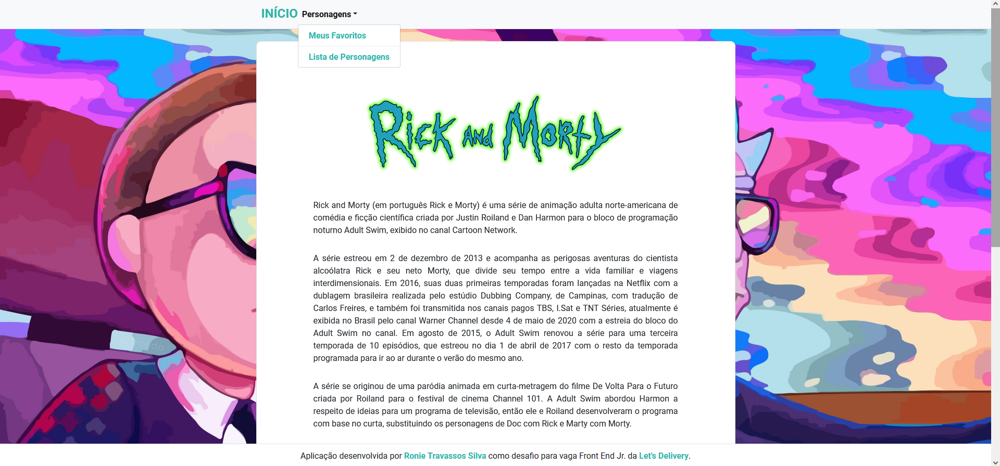

<h1>
    
</h1>

# Desafio Dev Front End Jr Elofy

## Sobre

Aplicação desenvolvida em  desafio para vaga de dev front end junior da Let's Delivery, compondo uma aplicação client-side que consome dados da API de <span lang="en">"Rick And Morty"</span>, retornando uma lista com todos os personagens da animação exibidas em uma tabela com informações sobre cada personagem, sendo possível ainda adicionar personagens a uma lista de favoritos e visualizar essa lista.

---

<h4 align="center"> 
	🚧  Concluído  🚧
</h4>

---

## Índice

* [Sobre](#sobre)
* [Requisitos](#requisitos)
* [Como Baixar e Iniciar](#como-baixar-e-iniciar)
* [Tecnologias Utilizadas](#tecnologias-utilizadas)
* [Autor](#autor)

---

## Requisitos

- git
- npm
- node.js

---

## Como Baixar e Iniciar

```bash

#Clonar o repositório
$ git clone https://github.com/roniets/desafio_lets_delivery

#Entrar no diretório
$ cd desafio_lets_delivery

#Instalar as dependências
$ npm install

#Iniciar a aplicação
$ npm start

```

---

## Tecnologias Utilizadas

O projeto foi desenvolvido utilizando as seguintes tecnologias

- React.js
- TypeScript
- React-Bootstrap

---

## Autor

Desenvolvido por Ronie Travassos Silva 🚀
<br>
[](https://www.linkedin.com/in/ronie-travassos-silva-48769b61/) 
